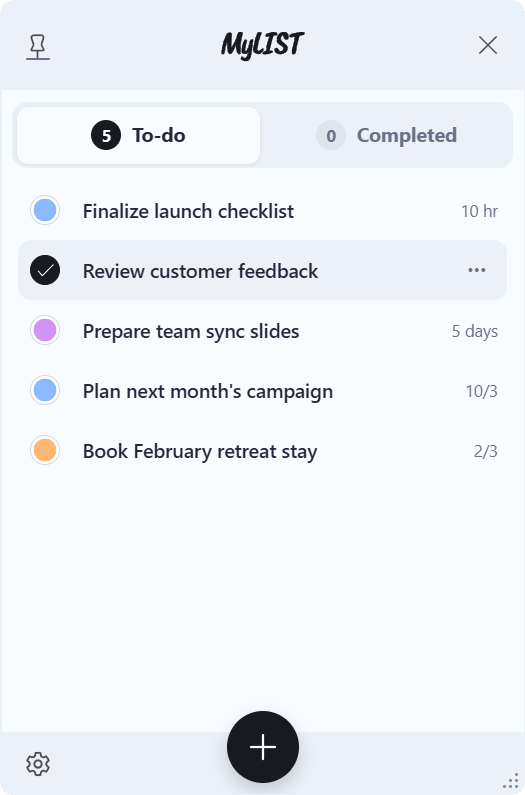
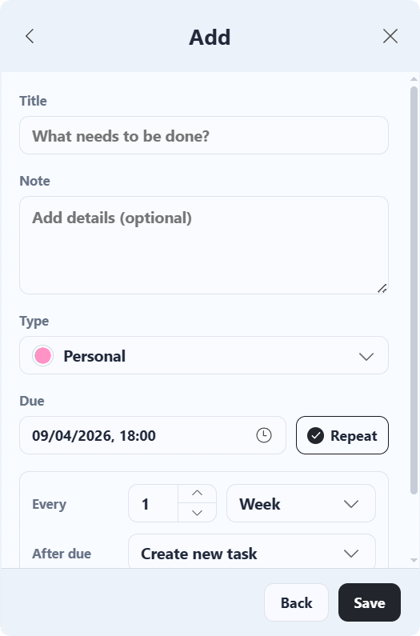
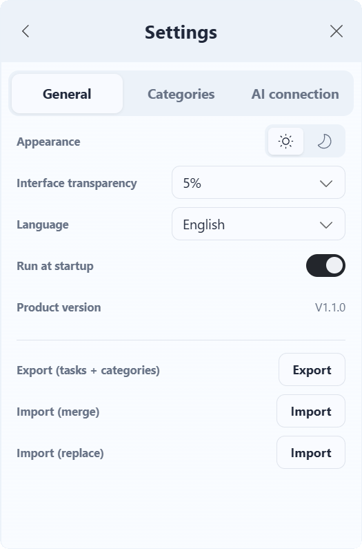
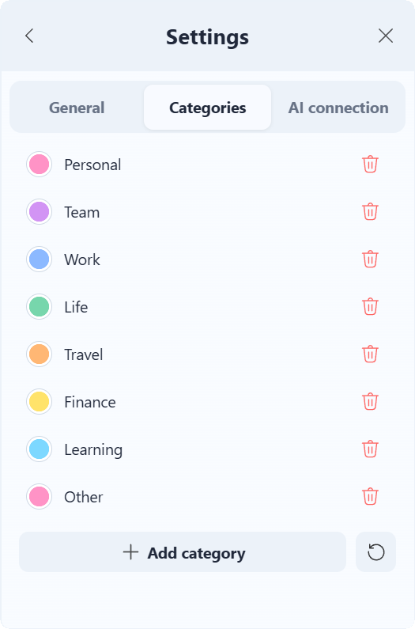
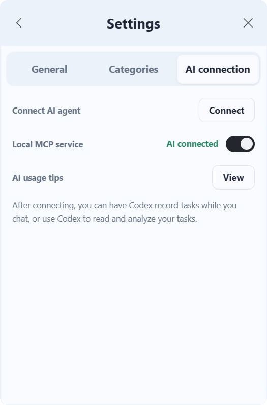

  

  <strong>Action starts with a list</strong>

  A lightweight, local-first task manager for Windows with multilingual UI, recurring tasks, secure data portability, and optional AI Agent integration.

  <a href="https://github.com/KoalaKyo/MyLIST/releases/latest"><strong>Download the latest Windows installer</strong></a>

## About MyLIST

MyLIST keeps everyday tasks close at hand without turning them into a complex project-management system. The desktop window can stay available above other apps, collapse at the top of the screen, and organize tasks with categories, due dates, notes, and recurrence.

Task data is stored locally. AI connectivity is optional and uses a local MCP service that can be enabled or disabled from the app.

> I spent a long time looking for a desktop to-do list that was minimal, polished, free, and ad-free. I could not find one, so I built it myself.

### A focused desktop task list

  

## Highlights

- Fast task capture, editing, completion, restoration, and deletion
- Custom categories and color organization
- Due dates and recurring tasks
- Compact desktop, always-on-top, and top-edge auto-hide modes
- Light and dark appearance with adjustable transparency
- Local data storage with plaintext or password-encrypted export
- Merge and replace import workflows with preview
- Optional local MCP integration for AI Agents such as Codex
- Simplified Chinese, Traditional Chinese, English, German, French, Italian, Spanish, and Japanese
- Custom multilingual installer and uninstaller

## Create tasks without friction

Add a task with only a title, or include notes, a category, a due date, and a recurrence rule when you need more structure.

  

## Make MyLIST yours

Adjust appearance and transparency, organize tasks with color-coded categories, choose from eight interface languages, and connect an AI Agent through the optional local MCP service.

  
  
  

## Download

Download the signed or checksum-verified installer from the [latest GitHub Release](https://github.com/KoalaKyo/MyLIST/releases/latest).

The formal Windows package is named:

    MyLIST_<version>_x64-setup.exe

GitHub source archives are not Windows installers. Use the EXE attached to the release.

## AI Agent integration

MyLIST can expose local task tools through MCP. After installing the supplied MCP configuration and Skill, an AI Agent can create or inspect tasks when the user's prompt matches the configured workflow. The local MCP service remains under the user's control in MyLIST settings.

The connection guide is bundled with the application and installer.

## Privacy

- Tasks are stored on the local Windows device.
- The MCP service listens locally and can be disabled.
- Encrypted exports are protected with a user-provided password.
- MyLIST does not require an online account for normal task management.

## Development

The Windows client uses React, TypeScript, Vite, Tauri, Rust, and SQLite.

Prerequisites:

- Node.js and npm
- Rust toolchain
- Windows build tools required by Tauri

Build the web frontend:

    cd app/windows-client
    npm install
    npm run build

Run Rust tests:

    cargo test --manifest-path app/windows-client/src-tauri/Cargo.toml

Formal MyLIST packaging is maintained through the repository's standard build tool. Do not call lower-level installer scripts directly:

    powershell -NoProfile -ExecutionPolicy Bypass -File tools/mylist-build.ps1 -Mode Release -Version <version>

## Repository layout

| Path | Purpose |
| --- | --- |
| app/windows-client | Production Windows application |
| app/windows-client/installer-shell | Custom installer and uninstaller UI |
| design/brand | Product logo and icon sources |
| docs | Public English documentation |
| tools | Controlled build, release, and archive tools |
| .agents/skills | Project-scoped Codex maintenance rules |

## Status

MyLIST is under active development. Review the release notes and checksums attached to each GitHub Release before installation.
